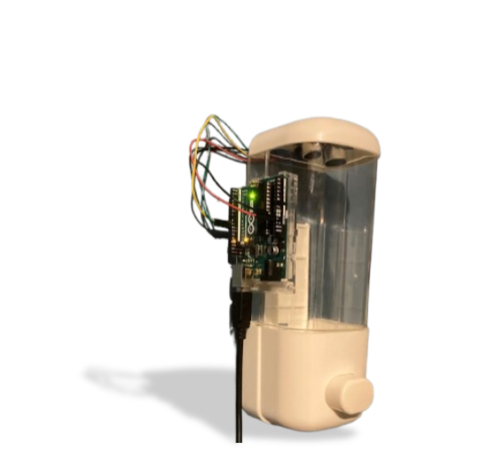

# Smart Soap Monitor - IoT Solution 🧴🔗
Un proyecto innovador para mejorar la higiene y optimizar el mantenimiento en instituciones educativas.

## 📋 Descripción del Proyecto
Este proyecto IoT está diseñado para monitorear en tiempo real el nivel de jabón en los dispensadores de una institución educativa. Al combinar sensores ultrasónicos, microcontroladores y una Raspberry Pi, la solución envía alertas al personal de aseo mediante un bot de Telegram cuando los niveles de jabón son bajos o críticos.

La solución tiene como objetivo:
- Promover un ambiente más higiénico y saludable.
- Facilitar las labores del personal de mantenimiento al automatizar el monitoreo.
- Reducir problemas de desabastecimiento en los dispensadores.

## 🎯 Características Principales
- Monitoreo en Tiempo Real: Utiliza sensores ultrasónicos para medir con precisión el nivel de jabón.
- Notificaciones Automatizadas: Genera alertas enviadas al grupo de Telegram del personal de aseo.
- Escalabilidad: El diseño es adaptable para múltiples dispensadores en diferentes ubicaciones.
- Conexión IoT: Usa una Raspberry Pi para procesar datos y gestionar la comunicación con Telegram.

## 🛠 Tecnologías Utilizadas
### Hardware:
- Arduino UNO: Obtiene las mediciones del nivel de jabón usando un sensor ultrasónico.
- Sensor Ultrasónico HC-SR04: Mide la distancia entre el sensor y la superficie del jabón.
- Raspberry Pi 5: Procesa los datos y ejecuta el bot de Telegram.

### Software:
- Python: Para la programación de la Raspberry Pi y la integración con el bot de Telegram.
- Arduino IDE: Para programar el Arduino UNO.
- Telegram Bot API: Manejo de alertas al personal de aseo.
- Serial Communication: Intercambio de datos entre el Arduino y la Raspberry Pi.
